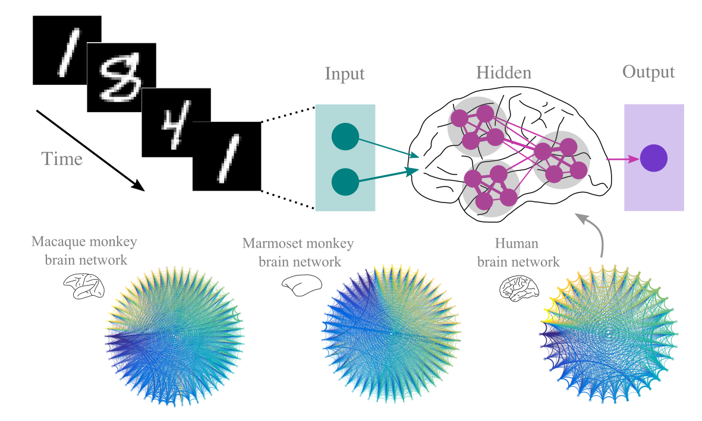

# Bio-instantiated recurrent neural networks and working memory

Create and train bio-instantiated recurrent neural networks that perform working memory tasks. 

 

# Description
While the interest in the relation between artifical and biological neural networks has generated a plethora of studies, attention is primarily directed towards the neurobiological plausibility of learnign rules and the similarity of visual representation in artificial and natural systems. The similarity and differences of the ***network topology*** of artificial and natural systems is examined only through the lens of abstract analogies, without a direct incorporation of the network topology found in biological neural system, such as the primate brain, in artifical neural networks.

This project instantiates the topology of biological neural networks (monkey and human brain networks) in recurrent neural networks with different strategies. The bio-instantiated artifical networks are tested in working memory tasks, that is, tasks that require tracking of information across time.

The contributions of the project are as follows:

* Highlighting the best strategy for converting empricial network data to artificial recurrent neural networks
* Demonstrating the effects of biological network topology in the performance of the artifical networks (minimization of loss, speed of training)
* Using network topology data from different species, thus examining the effects of biological network topology from a universal, cross-species standpoint 

# Usage
## Installation
Clone the repository and create a virtual environment (e.g., with conda) with the requirements.txt

## Running the experiements
All experiments can be run by executing ***biornnmemory.py***. The parameters needed are specified in the ***config.ini***

For each task, there is a template config.ini file in the ***config*** folder.

Copy the content of the .ini file that corresponds to the tasks that you want to be executed in the experiment to be run and paste it in the confi.ini file in the root directory of the repository.

There are several parameters that exist in the config.ini file, which looks like this:

```
[paths]
path_to_network = /Users/alexandrosgoulas/bio2art/connectomes/
path_to_results = /Users/alexandrosgoulas/rnn-bio2art-sequence-mem/test
pretrained = 

[net]
net_name = Marmoset_Normalized
rnn_size = 55
nr_neurons = 4
rand_partition = True
random_w = False

[trainvalidate]
epochs = 500
iterations = 5
init = default
freeze_layer = False
remap_w = True

[trialparams]
trial_params = {"task_name":"seq_mem", "nr_of_trials":500, "train_size":0.8}

[combosparams]
combos_params = {"lr":[0.0001,0.000001], "nonlinearity":["relu","tanh"], "optimizer":["Adam","RMSprop"], "pattern_length": [3, 5, 10]}

[pretrainedparams]
pretrained_epoch = 0
pretrained_iteration = 0
```
 
The content above pertains to the sequential memory task, but the majority of the parameters apply to other tasks as well. Let's see what each one of them does.

## Config.ini parameters

### Paths

```
[paths]
path_to_network = /Users/alexandrosgoulas/bio2art/connectomes/
path_to_results = /Users/alexandrosgoulas/rnn-bio2art-sequence-mem/test
pretrained = 
```
Here the path for saving the results ```path_to_results ``` and with the location of the empirical biological networks (connectomes) ```path_to_network ``` are specified. 

Biological neural networks are available in the [bio2art](https://github.com/AlGoulas/bio2art) package.

Note that the ```pretrained ``` parameter is used for loading pretrained models. This option is not used in the current project, but is available for further experimentation.

### Biological neural network

```
[net]
net_name = Marmoset_Normalized
rnn_size = 55
nr_neurons = 4
rand_partition = True
random_w = False
```
These parameters pertain to the [bio2art](https://github.com/AlGoulas/bio2art) package that converts empirical data from biological neural networks to a format that can be incorporated in artificial recurrent neural networks. All the parameters are  [explained in detail](https://github.com/AlGoulas/bio2art) in the documentation of aforemention package.

The ```random_w``` parameter dictates if the models will be trained with the weights adhering to the network topology of the selected biological neural network ```random_w = False``` or a randomized version thereof ```random_w = True```  

### Training and weight initialization

```
[trainvalidate]
epochs = 500
iterations = 5
init = default
freeze_layer = False
remap_w = True
```

These parameters (apparently) pertain to the train and validation of the model. ```epochs``` are the epochs across which the model will be trained and validated. ```iterations``` are the number of times the model will be trained and validated with different initialization each time (also known as 'runs').```init``` specifies the weight initialization scheme. Three options are available: [default](https://pytorch.org/docs/stable/generated/torch.nn.RNN.html) [xavier](https://pytorch.org/docs/stable/nn.init.html) and [he](https://pytorch.org/docs/stable/nn.init.html):
```init = default```, ```init = xavier```, ```init = he```
 
```freeze_layer``` indicates if the recurrent hidden layer should be trained ```freeze_layer = False``` or not ```freeze_layer = True``` 

The weights of the recurrent hidden layer are initialized based on the ```init``` parameter. With ```remap_w``` we can specify if the weights from these random initialization schemes should be remapped ```remap_w = True``` so that their rank-order matched the weights of the biological neural network that we are using. If ```remap_w = False``` then a random initialization of weights with no remapping takes place.  

### Tasks and trial parameters

```
[trialparams]
trial_params = {"task_name":"seq_mem", "nr_of_trials":500, "train_size":0.8} 
```

```trial_params``` is a dictionary with the following keys:

Here we specify the```task_name```:```"seq_mem", "pic_latent_mem" "nback_mem"```

The ```"nr_of_trials"``` specifies how many trials of the task we need for training and validating the model.

The ```"train_size"``` specifies the percentage of the trials that are needed for training the model.

### Combinations of parameters 

```
[combosparams]
combos_params = {"lr":[0.0001,0.000001], "nonlinearity":["relu","tanh"], "optimizer":["Adam","RMSprop"], "pattern_length": [3, 5, 10]}
```

```combos_params ``` is a dictionary with the following keys:

```"lr"``` is a list of float with the learning rates that we want to use for training the model.

```"nonlinearity"``` is a list of str specifying what nonlinear activation function will be used ny the neurons. Two options: "relu", "tanh".

```"optimizer"``` is a list of str specifying what optimizer will be used to train the model. Three options: "Adam", "RMSprop", "SGD".

```"pattern_length"``` is a list of int that specifies the length of the sequence to be memorized. Note that this parameter is task-dependent. ```"pattern_length"``` is for the ```seq_mem``` task.For the ```"n_back"``` and ```"pic_latent_mem"``` tasks, the key ```"n_back"``` with a list of int as value should be specified (see the template config files for each task in the config folder).

### Pretraining parameters

```
[pretrainedparams]
pretrained_epoch = 0
pretrained_iteration = 0
```

These parameters pertain to cases where we use pretrained models. This is not the case in this project, but such options are available for further experimentation.

# Visualization of results

We can use the **lossvisualization.py** script to visualoze the results of the experiments.

Let's assume that we have run two experiments: in one experiment we have trained models with biologically, that is, we have specified ```random_w = False``` in the config file, as explained above, and in the other experiment we have trained models with random topology, that is, ```random_w = True```

The results of these experiments are stored in the folders
 
```
/Users/alexandrosgoulas/Data/rnn_bio/bio 
/Users/alexandrosgoulas/Data/rnn_bio/rand 
```
for the experiments with the biologically-based (bio) and random (rand) topology, respectively. 

We can visualize the results of the experiments (loss function across epochs for train and validate sets) with the following command from the IPython console:

```
!python3 lossvisualization.py --results_folders /Users/alexandrosgoulas/Data/rnn_bio/bio /Users/alexandrosgoulas/Data/rnn_bio/rand --results_labels bio rand --save_figs /Users/alexandrosgoulas/Data/rnn_bio/figs --ylabel loss
```

where ```--results_labels bio rand``` specifies the labels that will be used for the visualization of the results from the experiments, ```--save_figs /Users/alexandrosgoulas/Data/rnn_bio/figs``` is the folder where the figures wil be saved and ```--ylabel loss``` specifies the label that will be placed in the yaxis in the plots visualizg the results (here: "loss").

Note that an arbitrary set of results folders and results labels can be specified, provided that if N results folders are specified, then results labels should also be specified.  

# Citation
```
@article {Goulas2021,
	author = {Goulas, Alexandros and Damicelli, Fabrizio and Hilgetag, Claus C},
	title = {Bio-instantiated recurrent neural networks},
	elocation-id = {2021.01.22.427744},
	year = {2021},
	doi = {10.1101/2021.01.22.427744},
	publisher = {Cold Spring Harbor Laboratory},
	URL = {https://www.biorxiv.org/content/early/2021/01/23/2021.01.22.427744},
	eprint = {https://www.biorxiv.org/content/early/2021/01/23/2021.01.22.427744.full.pdf},
	journal = {bioRxiv}
}
```

 
 
